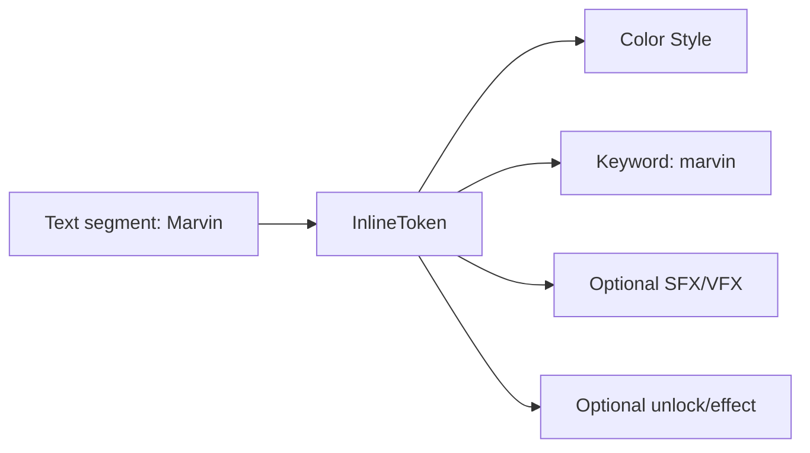
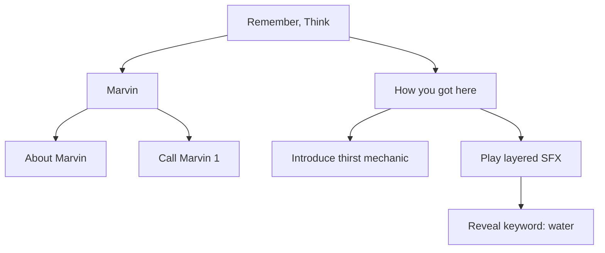
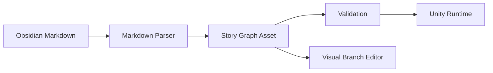

# Branching System Options

## Trenutno stanje

Trenutno imas 2 paralelna modela:

- `Assets/Game/Dark.json` kao stariji runtime-friendly format
- Obsidian `.md` fajlove kao noviji authoring format

Iz trenutnih `.md` primjera vidi se da ti branching vise nije samo "choice -> result -> next":

- `[[Choice Name]]` linka na druge choice/story fajlove
- `requirements` moze imati jedan uvjet, vise uvjeta i `or` logiku
- `event` moze znaciti unlock, timed event, mechanic intro, SFX trigger ili nesto trece
- postoje `Permanent interactions` koji nisu vezani uz jednu sobu
- inline oznake poput `**==Marvin==**`, `**==door==**`, `**==water==**` mogu znaciti stil, efekt, SFX ili kombinaciju
- choice ili keyword mogu dati item, flag, unlock ili otvoriti dodatne choiceve

To znaci da je igra vec presla granicu gdje ce "flat json + string parsing" dugorocno ostati cist.

## Opcije

### 1. Ostati na markdownu i samo ga prosirivati

Znaci:

- zadrzis Obsidian kao glavni editor
- definiras stroza pravila za `.md`
- u Unityju napravis jaci parser i validator

Primjer smjera:

- `[[About Marvin]]` = outgoing link
- `requirements: pull_franks_leg and (item_metal_shard or item_wooden_stake)`
- `event:` blok postane strukturiraniji
- inline tagovi dobiju standardni format, npr. `==keyword:marvin==`

Prednosti:

- najmanji prekid trenutnog workflowa
- writer-friendly
- Obsidian backlinkovi i pregled ostaju korisni

Mane:

- vizualni branching ostaje ogranicen
- parser brzo postane kompleksan
- inline sintaksa ce s vremenom postati pretrpana
- teze je validirati sve edge-caseove

Kad je dobro:

- ako zelis sto prije nastaviti pisati content
- ako ti vizualni editor nije prioritet odmah

### 2. Sve prebaciti u strukturirani JSON/YAML

Znaci:

- markdown vise nije source of truth
- svi nodeovi, choicevi, conditioni i efekti su striktno strukturirani

Prednosti:

- lako validiranje
- lako serijaliziranje
- jasno za runtime

Mane:

- lose za pisanje narativa
- tesko za pisce i brzi content iteration
- bez custom editora postaje naporno

Kad je dobro:

- ako je primarni cilj samo robustan runtime, ne i authoring experience

### 3. Full custom Unity editor + ScriptableObject graph

Znaci:

- source of truth je Unity graph editor
- svaki story node, choice, requirement i effect je asset ili sub-asset
- branching editas vizualno

Prednosti:

- najbolji vizualni branching
- najjaca validacija i tooling podrska
- inline keywordovi mogu postati pravi objekti

Mane:

- najveci pocetni trosak
- writeri moraju raditi unutar Unityja
- gubis dio Obsidian workflowa i brzine

Kad je dobro:

- ako zelis dugorocno editor-first pipeline
- ako ce puno sistema ovisiti o branching toolingu

### 4. Hybrid model: markdown authoring + canonical custom graph

Ovo je po meni najbolja opcija za ovaj projekt.

Znaci:

- `.md` ostaje writer/source format
- Unity import pipeline parsira `.md`
- iz toga se generira canonical graph model
- taj graph je vizualno editable i validatable u Unity editoru
- po potrebi mozes podrzati round-trip ili napraviti da je markdown source, a graph read-only/generated

Prednosti:

- zadrzavas Obsidian i brzinu pisanja
- dobivas vizualni branching 
- runtime ne ovisi o krhkom raw markdown parsiranju
- mozes postupno migrirati bez rewritea svega

Mane:

- treba jasno odluciti sto je source of truth
- round-trip editiranje je tesko ako i Obsidian i Unity smiju mijenjati istu stvar

Kad je dobro:

- kad imas narrative-heavy projekt
- kad zelis i writer-friendly authoring i ozbiljan custom editor

## Preporuka

Preporucujem **opciju 4: hybrid model**, ali s vrlo jasnim pravilom:

`Markdown je authoring source. Graph je generated canonical runtime/editor view.`

To je najstabilniji pristup jer:

- vec sada koristis Obsidian md linkove kao prirodan branching alat
- content ti vec sadrzi semantiku koja vise nije samo tekst
- inline elementi poput `==Marvin==` prirodno zele postati objekti s metapodacima
- permanent interactions i room-local interactions traze isti model, samo drugaciji `scope`

## Kako bi custom rjesenje trebalo izgledati

### Core model

Predlazem da canonical model bude graph sastavljen od ovih koncepata:

- `StoryNode`
- `ChoiceLink`
- `ConditionGroup`
- `Effect`
- `InlineToken`
- `StoryScope`
- `StoryKeyword`

### 1. StoryNode

Jedan `.md` fajl najcesce mapira na jedan `StoryNode`.

Node sadrzi:

- `Id`
- `Title`
- `Scope`
- `Location/Room`
- `TextVariations`
- `ContentBlocks`
- `OutgoingChoices`
- `Conditions`
- `Effects`
- `Tags`

Vrste nodeova:

- `Interaction`
- `Reaction`
- `Event`
- `TimedEvent`
- `KeywordTopic`
- `PermanentInteraction`
- `RoomEntry`

### 2. ChoiceLink

Umjesto da `[[About Marvin]]` bude samo tekstualni link, on postaje edge u graphu.

Choice edge treba imati:

- `PromptText`
- `TargetNodeId`
- `Conditions`
- `Effects`
- `Priority`
- `Visibility`
- `ConsumesInput`

To omogucava:

- isti target iz vise mjesta
- vise razlicitih uvjeta za isti izbor
- fallback ili hidden choiceve

### 3. ConditionGroup

Ovo je kljucno jer ti trenutni `requirements` vec traze slozeniju logiku od obicnog "all of".

Model:

- `All`
- `Any`
- `Not`

Leaf condition tipovi:

- completed node
- unlocked event
- has item
- missing item
- stat threshold
- room state
- keyword seen
- timed window active
- flag value

Primjer:

```text
All(
  Completed("pull_franks_leg"),
  Any(
    HasItem("item_metal_shard"),
    HasItem("item_wooden_stake")
  )
)
```

To je puno zdravije od string parsing-a tipa:

```text
item_metal_shard and pull_franks_leg
```

### 4. Effect

`event` ne bi trebao biti slobodni tekst ako zelis skalirati.

Umjesto jednog "event" stringa, uvedi listu efekata:

- `UnlockNode`
- `UnlockKeyword`
- `GrantItem`
- `RemoveItem`
- `SetFlag`
- `PlaySfx`
- `StartTimedEvent`
- `RevealChoice`
- `RevealKeyword`
- `ApplyStatus`
- `TransitionRoom`
- `AddJournalEntry`
- `TriggerMechanicIntro`

Tako `How you got here.md` i slicni fajlovi mogu imati:

- text block
- SFX cue na startu bloka
- unlock thirst mechanic
- reveal water keyword

### 5. InlineToken

Ovo je dio koji ce ti najvise pojednostaviti `==Marvin==` problem.

Nemoj drzati inline markup kao "stil-only" string.
Neka svaki oznaceni segment postane token objekt:

- `Text`
- `Type`
- `Style`
- `KeywordId`
- `SfxId`
- `VfxId`
- `Tooltip`
- `OnRevealEffects`
- `OnFocusEffects`
- `OnClickEffects`

Tipovi:

- `Keyword`
- `SfxCue`
- `StyleOnly`
- `InteractableWord`
- `ItemMention`
- `StatusHint`

Primjer:




To ti rijesava problem "jedna rijec moze znaciti vise stvari" bez hrpe specijalnih znakova u samom tekstu.

### 6. StoryScope

Scope mora biti first-class podatak, ne samo folder convention.

Predlozeni scopeovi:

- `RoomLocal`
- `Global`
- `Permanent`
- `Character`
- `System`

Primjeri:

- `How you got here` = `Permanent`
- `Air duct forward` = `RoomLocal`
- `Marvin` topic = `Character` ili `Permanent`

### 7. StoryKeyword

Ako zelis da pojedine rijeci budu "objekti", uvedi poseban keyword katalog.

`StoryKeyword` moze imati:

- `Id`
- `DisplayText`
- `Synonyms`
- `DefaultStyle`
- `OptionalSfx`
- `OptionalVfx`
- `UnlockConditions`
- `OnDiscoveredEffects`
- `LinkedNodes`

To znaci da `Marvin`, `door`, `water`, `military lighter` ne moraju svaki put iznova nositi sve informacije u raw tekstu.

## Vizualni editor

Ako ides na custom rjesenje, vizualni editor treba biti graph-first.

Preporuka:

- Unity `GraphView` ili noviji `Graph Tools Foundation` ako zelis ici ozbiljnije
- jedan graph po featureu / sobi / chapteru
- minimap
- search
- warnings panel
- validation panel
- filters po scopeu, roomu, characteru i itemu

Node tipovi u editoru:

- `Story Node`
- `Choice Node`
- `Condition Node`
- `Effect Node`
- `Keyword Node`
- `Timed Event Node`

Vizualno:




Najvaznije: editor ne mora prikazivati svaki inline token kao zaseban node po defaultu.
Bolje je imati:

- glavni story graph
- optional "expand token details" panel za odabrani node

Inace bi graph vrlo brzo postao prenatrpan.

## Kako spojiti markdown i graph

Najzdraviji pipeline:

1. Writer mijenja `.md`
2. Importer parsira frontmatter/sekcije/linkove/tagove
3. Parser generira `StoryGraphAsset`
4. Validator prijavljuje greske
5. Runtime cita generated graph, ne raw markdown

To izgleda ovako:




## Source of truth pravilo

Ovo moras odluciti odmah.

Imas 2 zdrave varijante:

### A. Markdown is source of truth

- writeri rade u Obsidianu
- Unity graph je generated
- u Unity editoru mozes editati metadata koja se vraca u `.md` samo ako napravis round-trip support

Ovo preporucujem za start.

### B. Graph is source of truth

- Unity editor je glavni alat
- markdown se samo exporta za citanje/pitching

Ovo preporucujem tek ako kasnije potpuno predjes na custom tool.

## Sto ne bih preporucio

Ne bih preporucio da:

- i `.md` i Unity graph budu ravnopravni writable source
- `requirements` i `event` ostanu slobodni tekst predugo
- sve inline efekte nastavis gurati kroz jos vise specijalnih znakova

To najcesce zavrsi sa:

- parser edge-caseovima
- content driftom
- teskim debuganjem unlock logike

## Minimalna verzija koju mozes napraviti prvo

Ako zelis ici iterativno, ovo je dobar redoslijed:

1. Standardiziraj markdown spec
2. Uvedi parser koji pravi `StoryNode` + `ChoiceLink` + `ConditionGroup` + `Effect`
3. `[[...]]` linkove pretvori u prave edgeove
4. `requirements` prebaci iz raw stringa u parsani condition tree
5. `event` prebaci u strukturirane effecte
6. `==keyword==` prebaci u `InlineToken`
7. Tek onda napravi vizualni editor nad generated graphom

Tako najprije rjesavas model, pa UI editor.

## Moj konkretan prijedlog za ovaj projekt

Kratko:

- zadrzi Obsidian markdown
- uvedi strogi branching DSL unutar markdowna
- generiraj `StoryGraphAsset` u Unityju
- napravi custom graph editor za pregled, validaciju i selective editing
- keywordove poput `Marvin`, `door`, `water` prebaci na `StoryKeyword` objekte
- `Permanent interactions` modeliraj kao isti node tip sa scopeom `Permanent`

Drugim rijecima:

**Ne raditi vise "custom branching kao puno novih znakova u markdownu".**

Umjesto toga:

**Raditi custom branching kao pravi data model, a markdown neka bude samo authoring syntax za taj model.**

## Ako zelis najpragmaticniju odluku

Od svih opcija:

- najbolji kratkorocno: `prosireni markdown + parser`
- najbolji dugorocno: `hybrid markdown + custom graph`
- najbolji samo za tooling: `full Unity graph editor`

Za `Text Darkness` bih izabrao:

**Hybrid markdown + custom graph editor**

jer najbolje cuva:

- writer workflow
- vizualni branching
- testabilnost
- validaciju
- buducu skalabilnost za iteme, evente, keywordove i permanent interactions

## Sljedeci korak

Ako hoces, sljedeci dokument koji vrijedi napraviti je:

`Branching DSL Spec.md`

U njemu bismo definirali tocnu sintaksu za:

- metadata / frontmatter
- conditions
- effects
- inline tokene
- outgoing linkove
- timed eventove
- permanent scope

To bi bio pravi temelj prije implementacije parsera i custom editora.